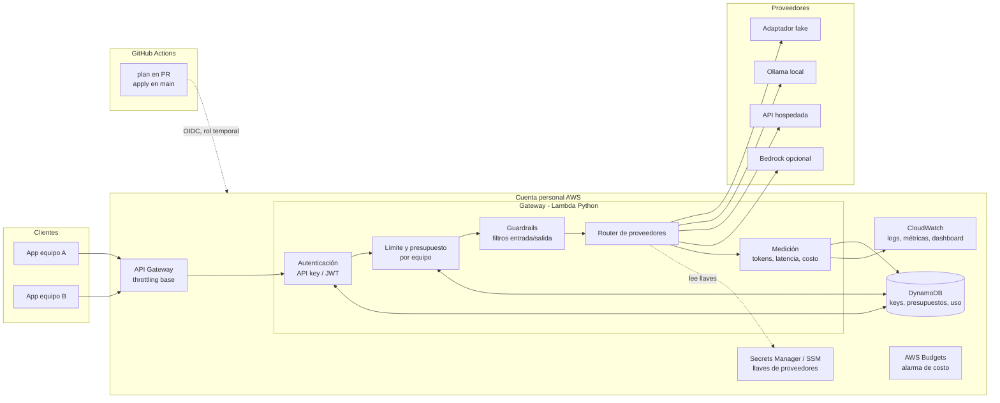

# Arquitectura general

Versión en AWS. En local, API Gateway + Lambda se reemplazan por FastAPI y DynamoDB por SQLite.
Ollama solo es alcanzable en modo local.

```mermaid
flowchart LR
    subgraph Clientes
        A1[App equipo A]
        A2[App equipo B]
    end

    subgraph AWS["Cuenta personal AWS"]
        APIGW[API Gateway<br/>throttling base]
        subgraph GW["Gateway - Lambda Python"]
            AUTH[Autenticación<br/>API key / JWT]
            RL[Límite y presupuesto<br/>por equipo]
            GR[Guardrails<br/>filtros entrada/salida]
            ROUTER[Router de proveedores]
            METER[Medición<br/>tokens, latencia, costo]
        end
        DDB[(DynamoDB<br/>keys, presupuestos, uso)]
        SM[Secrets Manager / SSM<br/>llaves de proveedores]
        CW[CloudWatch<br/>logs, métricas, dashboard]
        BUD[AWS Budgets<br/>alarma de costo]
    end

    subgraph Proveedores
        FAKE[Adaptador fake]
        OLL[Ollama local]
        HOST[API hospedada]
        BED[Bedrock opcional]
    end

    subgraph CI["GitHub Actions"]
        PIPE[plan en PR<br/>apply en main]
    end

    A1 --> APIGW
    A2 --> APIGW
    APIGW --> AUTH --> RL --> GR --> ROUTER
    ROUTER --> FAKE
    ROUTER --> OLL
    ROUTER --> HOST
    ROUTER --> BED
    ROUTER --> METER
    AUTH <--> DDB
    RL <--> DDB
    METER --> DDB
    METER --> CW
    ROUTER -.lee llaves.-> SM
    PIPE -.OIDC, rol temporal.-> AWS
```
