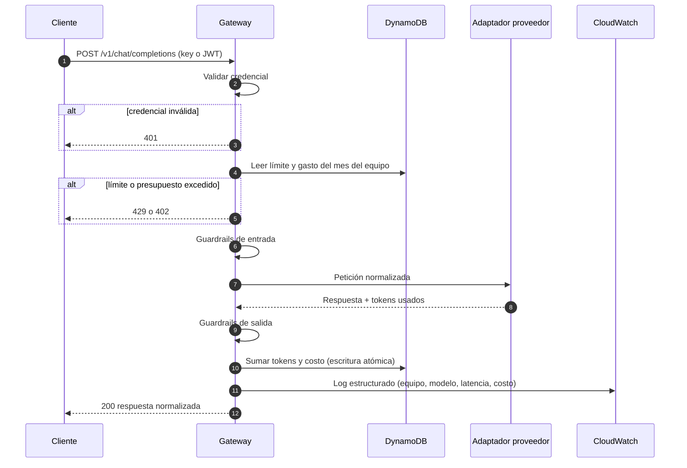
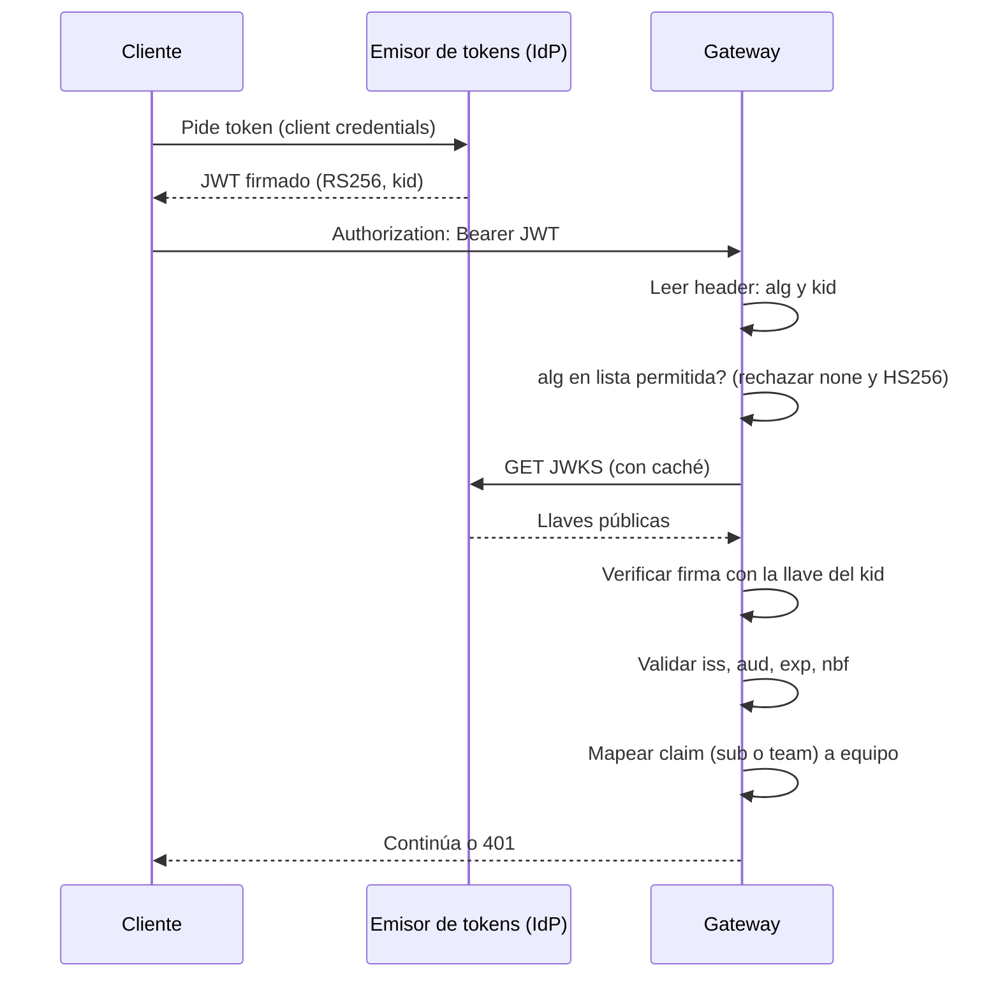
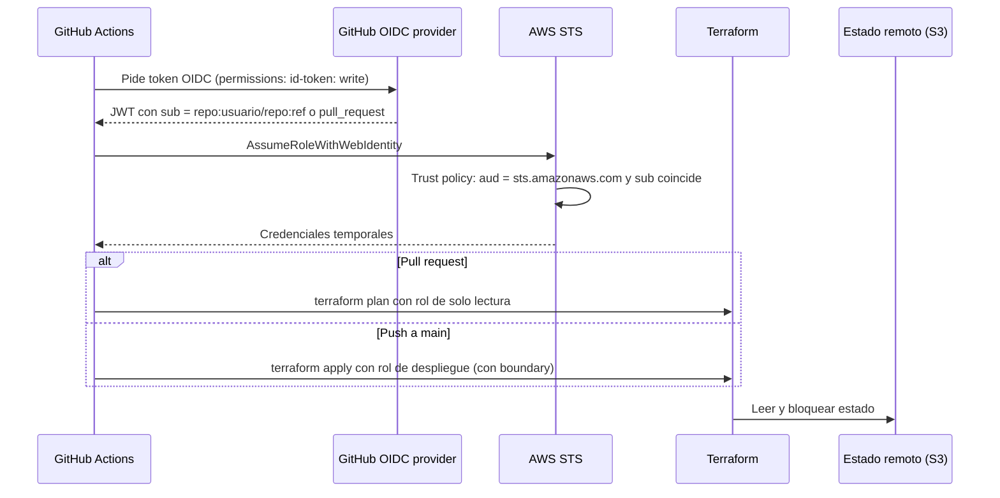

# Flujos

## Flujo de una petición

Lo barato y lo que rechaza (auth, límites, presupuesto) va antes de lo caro (el modelo).

```mermaid
sequenceDiagram
    autonumber
    participant C as Cliente
    participant G as Gateway
    participant D as DynamoDB
    participant P as Adaptador proveedor
    participant L as CloudWatch

    C->>G: POST /v1/chat/completions (key o JWT)
    G->>G: Validar credencial
    alt credencial inválida
        G-->>C: 401
    end
    G->>D: Leer límite y gasto del mes del equipo
    alt límite o presupuesto excedido
        G-->>C: 429 o 402
    end
    G->>G: Guardrails de entrada
    G->>P: Petición normalizada
    P-->>G: Respuesta + tokens usados
    G->>G: Guardrails de salida
    G->>D: Sumar tokens y costo (escritura atómica)
    G->>L: Log estructurado (equipo, modelo, latencia, costo)
    G-->>C: 200 respuesta normalizada
```

## Autenticación con JWT

```mermaid
sequenceDiagram
    participant C as Cliente
    participant I as Emisor de tokens (IdP)
    participant G as Gateway

    C->>I: Pide token (client credentials)
    I-->>C: JWT firmado (RS256, kid)
    C->>G: Authorization: Bearer JWT
    G->>G: Leer header: alg y kid
    G->>G: alg en lista permitida? (rechazar none y HS256)
    G->>I: GET JWKS (con caché)
    I-->>G: Llaves públicas
    G->>G: Verificar firma con la llave del kid
    G->>G: Validar iss, aud, exp, nbf
    G->>G: Mapear claim (sub o team) a equipo
    G-->>C: Continúa o 401
```

## CI/CD con OIDC

```mermaid
sequenceDiagram
    participant GH as GitHub Actions
    participant OP as GitHub OIDC provider
    participant STS as AWS STS
    participant TF as Terraform
    participant S3 as Estado remoto (S3)

    GH->>OP: Pide token OIDC (permissions: id-token: write)
    OP-->>GH: JWT con sub = repo:usuario/repo:ref o pull_request
    GH->>STS: AssumeRoleWithWebIdentity
    STS->>STS: Trust policy: aud = sts.amazonaws.com y sub coincide
    STS-->>GH: Credenciales temporales
    alt Pull request
        GH->>TF: terraform plan con rol de solo lectura
    else Push a main
        GH->>TF: terraform apply con rol de despliegue (con boundary)
    end
    TF->>S3: Leer y bloquear estado
```
